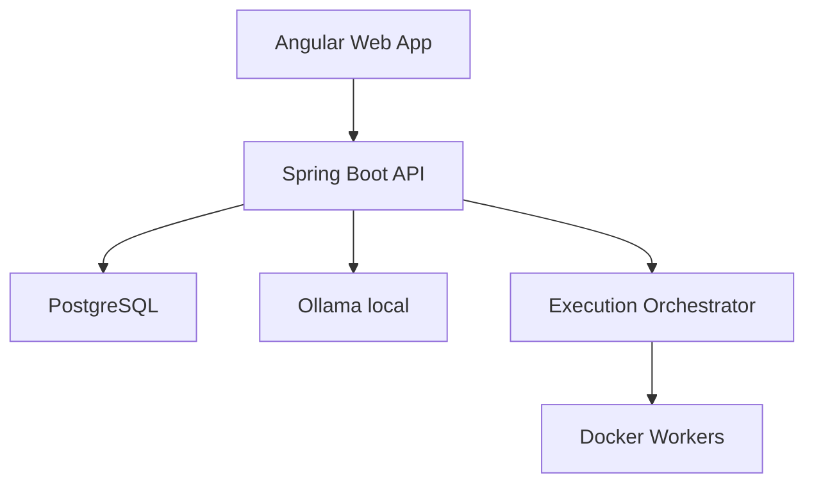
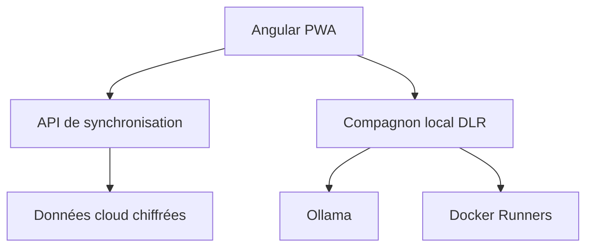

# DLR — Deep Learning & Review

## Document d'implémentation — Version 1.0

**Document associé :** [`DLR_Conception.md`](DLR_Conception.md)  
**Architecture :** application web responsive, local-first  
**Stack :** Java, Spring Boot, Angular, TypeScript, PostgreSQL, Ollama et Docker  
**Cible initiale :** utilisateur unique

---

## 1. Objectif du document

Ce document traduit la conception fonctionnelle de DLR en plan de réalisation technique. Il fixe l'architecture, les modules, les conventions, le modèle de données, les API, l'intégration Ollama, l'exécution sécurisée du code, les tests et l'ordre de développement.

Le principe directeur est de construire un monolithe modulaire pour la V1. Cette approche reste assez simple pour apprendre et livrer rapidement, tout en imposant des frontières métier claires qui permettront d'extraire certains composants plus tard si nécessaire.

## 2. Choix techniques

| Domaine | Choix initial | Justification |
|---|---|---|
| Backend | Java 21 + Spring Boot | renforcer Java moderne et les compétences recherchées en emploi |
| Frontend | Angular + TypeScript strict | apprendre TypeScript dans un cadre professionnel structuré |
| Expérience installable | Angular PWA + Service Worker | installation sur PC/mobile, cache applicatif et démarrage rapide |
| Base de données | PostgreSQL | base relationnelle robuste, SQL standard et bonne intégration JPA |
| Migrations | Flyway | schéma versionné et reproductible |
| ORM | Spring Data JPA + Hibernate | pratique professionnelle de la persistance Java |
| IA | Ollama local | confidentialité, absence de coût par requête et fonctionnement local |
| Éditeur | Monaco Editor | expérience proche de VS Code et support multilangage |
| Exécution | Docker Engine + workers | isolation des programmes Java, Python et TypeScript |
| Tests backend | JUnit 5, AssertJ, Mockito, Testcontainers | tests unitaires et intégration réelle avec PostgreSQL |
| Tests frontend | Vitest/Jasmine selon Angular, Testing Library, Playwright | tests de composants et parcours complets |
| Documentation API | OpenAPI/Swagger | contrat lisible et testable |
| Build | Maven pour le backend, Angular CLI/npm pour le frontend | outils standards des écosystèmes retenus |

Les versions exactes seront verrouillées lors de l'initialisation afin d'utiliser des versions stables et compatibles au moment du développement.

## 3. Architecture générale



### 3.1 Responsabilités

- **Angular** affiche les parcours, l'éditeur, les quiz, le calendrier et les statistiques.
- **Spring Boot** porte toutes les règles métier, calcule les scores et orchestre les services.
- **PostgreSQL** conserve le contenu pédagogique, les tentatives et la progression.
- **Ollama** fournit les explications, analyses qualitatives et défis adaptatifs.
- **Docker Workers** compilent, exécutent et testent le code dans un environnement limité.

## 4. Structure du dépôt

```text
dlr/
├── apps/
│   ├── api/
│   └── web/
├── runners/
│   ├── java-runner/
│   ├── python-runner/
│   └── typescript-runner/
├── content/
│   ├── java/
│   ├── python/
│   └── typescript/
├── infrastructure/
│   ├── docker/
│   └── scripts/
├── docs/
│   ├── DLR_Conception.md
│   ├── DLR_Implementation.md
│   └── DLR_CodeReview.md
├── compose.yaml
└── README.md
```

Le contenu des laboratoires est maintenu dans des fichiers versionnés puis importé dans PostgreSQL. Le code applicatif et le contenu pédagogique peuvent ainsi évoluer séparément.

## 5. Architecture backend

### 5.1 Style retenu

Le backend utilise un monolithe modulaire inspiré de l'architecture hexagonale :

- `domain` : objets métier et règles indépendantes du framework ;
- `application` : cas d'utilisation et orchestration ;
- `infrastructure` : JPA, Ollama, Docker et services externes ;
- `web` : contrôleurs REST, requêtes, réponses et gestion des erreurs.

### 5.2 Packages proposés

```text
com.dlr
├── catalog
├── learning
├── assessment
├── mastery
├── planning
├── gamification
├── tutor
├── execution
├── analytics
└── shared
```

Chaque module possède ses propres sous-packages `domain`, `application`, `infrastructure` et `web`. Une classe d'un module ne doit pas accéder directement au repository d'un autre module ; elle passe par un service applicatif public.

### 5.3 Modules backend

| Module | Responsabilités |
|---|---|
| `catalog` | langages, laboratoires, leçons, concepts clés et prérequis |
| `learning` | inscriptions, progression, sessions et tentatives |
| `assessment` | tests, quiz, checklists, scores et validations |
| `mastery` | maîtrise des concepts et répétition espacée |
| `planning` | calendrier, rythme 3/4 mois et rattrapage |
| `gamification` | XP, niveaux, badges, séries et récompenses |
| `tutor` | prompts, contexte, réponses et disponibilité Ollama |
| `execution` | soumissions, files d'attente, runners et résultats |
| `analytics` | agrégats, tendances, forces et faiblesses |

## 6. Architecture frontend

### 6.1 Structure Angular

```text
src/app/
├── core/
├── shared/
├── features/
│   ├── dashboard/
│   ├── paths/
│   ├── lab-workspace/
│   ├── key-concepts/
│   ├── reviews/
│   ├── calendar/
│   ├── achievements/
│   └── settings/
└── app.routes.ts
```

### 6.2 Principes Angular

- composants standalone ;
- TypeScript en mode strict ;
- Signals pour l'état local et dérivé ;
- RxJS pour les flux asynchrones et HTTP ;
- lazy loading par fonctionnalité ;
- services d'accès API séparés des composants ;
- formulaires réactifs ;
- aucune règle de score calculée uniquement dans le navigateur.

### 6.3 Écrans principaux

1. **Onboarding** : objectif, planning, récompenses et connexion Ollama.
2. **Tableau de bord** : séance du jour, progression, série, XP et alertes.
3. **Parcours** : carte des 24 activités et prérequis.
4. **Laboratoire** : théorie, concept clé, éditeur, tests, quiz et bilan.
5. **Concepts clés** : graphe de connexions, maîtrise et révisions.
6. **Calendrier** : séances prévues/réelles et rattrapages.
7. **Statistiques** : temps, scores, erreurs, tendances et faiblesses.
8. **Paramètres** : Ollama, runners, données et sauvegarde.

### 6.4 Direction artistique : professionnelle et ludique

L'interface doit donner l'impression d'un véritable environnement de développement et de progression professionnelle, sans ressembler à un tableau administratif froid. La partie ludique soutient la motivation, mais ne doit jamais masquer le contenu ni transformer la formation en jeu superficiel.

Principes visuels :

- hiérarchie nette, espaces généreux et densité réglable ;
- cartes de parcours inspirées d'une carte de progression, sans surcharge graphique ;
- animations courtes pour les réussites, niveaux et transitions ;
- graphiques sobres pour les scores, le temps et la maîtrise ;
- couleurs de statut cohérentes : découverte, en cours, acquis, solide et maîtrisé ;
- micro-récompenses visuelles après un effort vérifiable ;
- éditeur de code au centre de l'expérience pratique ;
- possibilité de réduire ou désactiver les animations ;
- aucune animation bloquante pendant une séance concentrée.

Le design system utilise des tokens CSS pour les couleurs, espacements, rayons, ombres, typographies et durées d'animation. Les composants ne doivent pas contenir directement des couleurs fixes.

### 6.5 Thèmes et confort visuel

L'utilisateur peut sélectionner au minimum :

1. **Système** : suit automatiquement le thème du système d'exploitation ;
2. **Clair professionnel** : fond légèrement cassé et contraste doux ;
3. **Sombre confort** : fond gris très foncé, sans noir absolu généralisé ;
4. **Focus** : couleurs réduites et distractions masquées pendant les exercices.

Le thème sombre est une exigence de la V1. Il doit éviter les contrastes agressifs, conserver une excellente lisibilité du code et distinguer clairement textes, panneaux, bordures et états interactifs. Le choix est sauvegardé localement puis synchronisé dans le profil.

Exigences d'accessibilité et de fatigue visuelle :

- contraste conforme au minimum WCAG AA ;
- taille de texte et interligne confortables ;
- option de police agrandie ;
- navigation complète au clavier ;
- prise en charge de `prefers-color-scheme` et `prefers-reduced-motion` ;
- palette ne reposant jamais uniquement sur la couleur ;
- rappel de pause configurable après une période de concentration ;
- mode plein écran/focus pour le laboratoire.

### 6.6 Ludification maîtrisée

La ludification se manifeste par la carte du parcours, les XP, niveaux, badges, séries, jalons, défis et petites célébrations. Elle respecte trois règles : récompenser un effort réel, ne pas punir le repos planifié et toujours montrer la maîtrise séparément des points accumulés.

Les célébrations sont proportionnelles : un petit retour visuel après un quiz, une animation plus marquée après un laboratoire, et une étape spéciale après un projet ou un défi final.

## 6A. Progressive Web App

DLR sera conçu comme une **PWA installable**. Angular fournit un Service Worker officiel et la commande `ng add @angular/pwa` configure le manifeste, les icônes, le cache et l'enregistrement du Service Worker.

### 6A.1 Capacités prévues

- installation depuis le navigateur sur PC et mobile ;
- lancement dans une fenêtre autonome ;
- cache de l'interface et des ressources statiques ;
- consultation hors ligne des cours déjà synchronisés ;
- brouillons de code et réponses stockés localement en attente de synchronisation ;
- détection d'une nouvelle version avec demande de mise à jour ;
- page hors ligne expliquant quelles fonctions restent disponibles ;
- notifications de rappel uniquement après consentement explicite.

### 6A.2 Limites hors ligne

La PWA ne peut pas remplacer les services lourds de la machine. Sans le backend local actif, PostgreSQL, les runners Docker et Ollama ne sont pas disponibles. Le mode hors ligne permet donc de lire, prendre des notes, répondre à certains quiz et préparer du code ; l'exécution et la correction IA reprennent lors de la reconnexion au backend.

Les données en attente sont placées dans IndexedDB avec un état de synchronisation explicite. Une file d'actions ne doit jamais envoyer deux fois la même tentative.

## 7. Modèle de données

### 7.1 Tables principales

| Table | Champs essentiels |
|---|---|
| `user_profile` | `id`, `display_name`, `target_months`, `weekday_minutes`, `weekend_minutes` |
| `learning_path` | `id`, `language`, `position`, `status` |
| `lab` | `id`, `path_id`, `number`, `slug`, `title`, `difficulty`, `threshold`, `type` |
| `lesson_section` | `id`, `lab_id`, `section_type`, `position`, `content_md` |
| `concept` | `id`, `code`, `name`, `description`, `is_key`, `importance` |
| `key_concept_content` | `concept_id`, `why_exists`, `why_important`, `mechanism`, `minimal_example`, `professional_example`, `common_mistake`, `mastery_question`, `mastery_proof` |
| `concept_relation` | `source_id`, `target_id`, `relation_type`, `explanation` |
| `lab_concept` | `lab_id`, `concept_id`, `role`, `weight` |
| `exercise` | `id`, `lab_id`, `type`, `statement_md`, `starter_code`, `solution_ref` |
| `test_case` | `id`, `exercise_id`, `visibility`, `weight`, `definition` |
| `quiz_question` | `id`, `lab_id`, `type`, `prompt`, `weight`, `rubric` |
| `attempt` | `id`, `lab_id`, `started_at`, `completed_at`, `score`, `status` |
| `submission` | `id`, `attempt_id`, `exercise_id`, `language`, `source_code`, `origin` |
| `test_result` | `id`, `submission_id`, `passed`, `duration_ms`, `details` |
| `quiz_answer` | `id`, `attempt_id`, `question_id`, `answer`, `score`, `feedback` |
| `concept_mastery` | `concept_id`, `level`, `confidence`, `last_seen_at`, `next_review_at` |
| `study_session` | `id`, `planned_at`, `planned_minutes`, `actual_minutes`, `status`, `reward` |
| `ai_interaction` | `id`, `purpose`, `model`, `prompt_version`, `input_hash`, `response`, `created_at` |
| `achievement` | `id`, `code`, `name`, `xp`, `rule_type`, `rule_config` |
| `user_achievement` | `achievement_id`, `earned_at`, `context` |

### 7.2 Contraintes importantes

- `lab(path_id, number)` est unique.
- Un concept clé doit posséder un enregistrement `key_concept_content` complet.
- Les anciennes tentatives et leurs scores sont immuables.
- Une soumission peut provenir de `EDITOR`, `PASTE` ou `IMPORT`.
- Les réponses IA sont séparées des résultats déterministes.
- Les suppressions de contenu pédagogique sont logiques afin de préserver l'historique.

## 8. Format du contenu pédagogique

Chaque laboratoire est décrit par un fichier YAML ou JSON validé par un schéma. Exemple conceptuel :

```yaml
code: JAVA-06
title: Classes, objets et encapsulation
threshold: 70
objectives:
  - Créer une classe cohérente
concepts:
  - code: JAVA-ENCAPSULATION
    key: true
    whyExists: Protéger les invariants d'un objet
    commonMistake: Rendre tous les champs publics
exercises:
  - code: BANK-ACCOUNT
    type: coding
quiz:
  - code: Q1
    type: connection
```

Un validateur refuse l'import si un identifiant est dupliqué, si un prérequis est impossible ou si un concept clé ne contient pas son « pourquoi » et sa preuve de maîtrise.

## 9. API REST initiale

### 9.1 Catalogue et progression

| Méthode | Route | Fonction |
|---|---|---|
| `GET` | `/api/paths` | lister les parcours et leur progression |
| `GET` | `/api/paths/{language}` | obtenir les 24 activités d'un parcours |
| `GET` | `/api/labs/{labId}` | charger le contenu d'un laboratoire |
| `POST` | `/api/labs/{labId}/attempts` | commencer une tentative |
| `GET` | `/api/attempts/{id}` | reprendre une tentative |
| `POST` | `/api/attempts/{id}/complete` | calculer le bilan final |
| `POST` | `/api/attempts/{id}/continue` | continuer malgré un seuil insuffisant |

### 9.2 Soumissions et évaluations

| Méthode | Route | Fonction |
|---|---|---|
| `POST` | `/api/attempts/{id}/submissions` | sauvegarder ou importer du code |
| `POST` | `/api/submissions/{id}/run` | exécuter les tests |
| `GET` | `/api/executions/{id}` | consulter l'état et les résultats |
| `PUT` | `/api/attempts/{id}/quiz/{questionId}` | enregistrer une réponse |
| `POST` | `/api/attempts/{id}/quiz/{questionId}/evaluate` | évaluer une réponse libre |
| `PUT` | `/api/attempts/{id}/checklist` | enregistrer l'auto-évaluation |

### 9.3 Concepts, IA et statistiques

| Méthode | Route | Fonction |
|---|---|---|
| `GET` | `/api/concepts/key` | lister les concepts clés et leur maîtrise |
| `GET` | `/api/concepts/{id}` | afficher le pourquoi, les connexions et exemples |
| `POST` | `/api/tutor/explain` | demander une explication contextualisée |
| `POST` | `/api/tutor/hint` | obtenir un indice progressif |
| `POST` | `/api/tutor/connect` | générer une question reliant des concepts |
| `GET` | `/api/dashboard` | charger les indicateurs principaux |
| `GET` | `/api/reviews/today` | obtenir les révisions du jour |
| `GET` | `/api/calendar` | charger le planning et l'historique |

## 10. Calcul des scores

Le backend calcule le score à partir des pondérations du laboratoire :

```text
score = tests × poidsTests
      + quiz × poidsQuiz
      + pratique × poidsPratique
      + connexions × poidsConnexions
      + autoEvaluation × poidsAutoEvaluation
```

Chaque sous-score est normalisé sur 100. Les arrondis sont appliqués uniquement au résultat final. La version du barème est enregistrée avec la tentative pour garantir la reproductibilité.

Une tentative sous le seuil produit :

- un statut `COMPLETED_BELOW_THRESHOLD` ;
- une liste de concepts fragiles ;
- de nouvelles dates de révision ;
- une recommandation explicite ;
- la possibilité de continuer après confirmation.

## 11. Maîtrise et révision espacée

Un service calcule la maîtrise à partir de quatre signaux : résultat immédiat, capacité d'explication, réussite différée et réutilisation dans un autre contexte.

Le calendrier initial suit J+1, J+3, J+7, J+14 et J+30. Une bonne réponse espace la prochaine révision ; une erreur rapproche l'échéance et réduit la confiance. Le calcul reste déterministe. Ollama peut créer la forme de la question, mais pas décider seul du niveau de maîtrise.

## 12. Intégration Ollama

### 12.1 Configuration

Paramètres configurables :

- URL locale, par défaut `http://localhost:11434` ;
- modèle sélectionné ;
- délai maximal ;
- température par type de tâche ;
- taille maximale du contexte ;
- activation ou désactivation de l'historique.

### 12.2 Adaptateur backend

Le module `tutor` définit une interface `AiTutorPort`. L'adaptateur `OllamaAiTutorAdapter` implémente :

- `explainConcept` ;
- `evaluateFreeAnswer` ;
- `generateHint` ;
- `generateConnectionQuestion` ;
- `proposeProfessionalProject` ;
- `generateFinalChallenge`.

Cette abstraction permettra de changer de modèle ou de fournisseur sans modifier les cas d'utilisation.

### 12.3 Sorties structurées

Les réponses utilisées par le métier sont demandées au format JSON et validées par schéma. Une réponse invalide est retentée une seule fois avec un prompt de réparation, puis transformée en erreur lisible sans modifier le score.

### 12.4 Construction du contexte

Le prompt n'envoie que les informations nécessaires : objectifs du laboratoire, concept concerné, réponse ou code utile, résultats de tests et niveau actuel. Les solutions officielles complètes ne sont jamais incluses dans un simple indice.

## 13. Exécution sécurisée du code

### 13.1 Pipeline

1. réception et validation de la soumission ;
2. création d'un identifiant d'exécution ;
3. placement dans une file locale ;
4. préparation d'un répertoire temporaire ;
5. lancement du conteneur du langage ;
6. compilation ou interprétation ;
7. exécution des tests visibles et cachés ;
8. collecte structurée des résultats ;
9. destruction du conteneur et nettoyage ;
10. publication du résultat au frontend.

### 13.2 Limites obligatoires

- réseau désactivé ;
- utilisateur non privilégié ;
- système de fichiers en lecture seule, sauf dossier temporaire ;
- durée maximale par exécution ;
- mémoire et CPU limités ;
- nombre de processus limité ;
- taille de sortie limitée ;
- aucune exposition du socket Docker dans un conteneur utilisateur.

La V1 est locale et mono-utilisateur, mais ces protections restent obligatoires puisque le code exécuté peut contenir une boucle infinie ou une instruction destructive par erreur.

## 14. Import depuis un IDE

La V1 accepte :

- collage direct du code ;
- import d'un ou plusieurs fichiers autorisés ;
- archive ZIP limitée et contrôlée pour les projets ;
- téléchargement d'un squelette d'exercice à ouvrir dans l'IDE.

Les chemins absolus, exécutables, liens symboliques et fichiers dépassant les limites sont refusés. Une extension IDE pourra être étudiée après le MVP.

## 15. Planning et gamification

Le planificateur reçoit une durée cible de trois ou quatre mois et les disponibilités. Il répartit les activités, les projets et les révisions sans dépasser la capacité quotidienne.

Les XP sont accordés pour l'effort vérifiable : séance terminée, révision effectuée, amélioration d'un score, concept expliqué ou projet livré. Répéter artificiellement une action simple ne produit pas d'XP illimité.

La série quotidienne accepte les jours de repos planifiés et peut disposer d'un joker hebdomadaire. Le tableau de bord distingue clairement régularité et maîtrise.

## 16. Gestion des erreurs

Le backend utilise un format d'erreur commun contenant :

- code fonctionnel stable ;
- message compréhensible ;
- détails de validation ;
- identifiant de corrélation ;
- action suggérée lorsque possible.

Exemples : `OLLAMA_UNAVAILABLE`, `RUNNER_TIMEOUT`, `INVALID_LAB_CONTENT`, `ATTEMPT_ALREADY_COMPLETED` et `IMPORT_FILE_REJECTED`.

## 17. Sécurité et confidentialité

- aucune authentification complexe dans la première version locale ;
- profil unique initialisé au premier démarrage ;
- ajout ultérieur possible de Spring Security si accès réseau ou multi-utilisateur ;
- secrets et paramètres sensibles hors du dépôt ;
- aucune donnée envoyée à un service IA externe par défaut ;
- export et suppression des conversations Ollama ;
- sauvegardes PostgreSQL chiffrables par l'utilisateur ;
- validation stricte de toutes les entrées et importations.

## 18. Stratégie de tests

### 18.1 Backend

- tests unitaires pour scores, seuils, maîtrise, planning et XP ;
- tests d'intégration repositories avec Testcontainers PostgreSQL ;
- tests de contrôleurs avec requêtes HTTP ;
- tests de contrat pour Ollama et runners simulés ;
- tests d'architecture pour empêcher les dépendances interdites entre modules.

### 18.2 Frontend

- tests unitaires des services et transformations ;
- tests de composants pour le laboratoire et les concepts clés ;
- tests d'accessibilité ;
- tests Playwright des parcours critiques.

### 18.3 Parcours critiques de bout en bout

1. commencer un laboratoire, coder, tester et terminer ;
2. échouer sous le seuil et continuer avec une révision créée ;
3. demander une explication Ollama puis répondre à une question de maîtrise ;
4. reprendre une tentative après redémarrage ;
5. importer une solution depuis un IDE ;
6. consulter un concept clé et ses connexions.

## 19. Observabilité

- logs structurés backend ;
- identifiant de corrélation par requête et exécution ;
- Actuator pour l'état de l'API, PostgreSQL, Ollama et runners ;
- mesures : durée des tests, taux d'erreurs Ollama, temps de réponse et taille des files ;
- journal fonctionnel séparé pour les changements de score et de maîtrise.

Le code des soumissions et les conversations ne doivent pas apparaître en clair dans les logs techniques.

## 20. Environnements

| Environnement | Usage |
|---|---|
| `local` | développement quotidien avec rechargement rapide |
| `test` | tests automatiques et services éphémères |
| `prod-local` | utilisation personnelle stable sur le PC |

`compose.yaml` démarre PostgreSQL et les services nécessaires. Ollama peut rester installé directement sur la machine, l'API utilisant une adresse configurable pour le joindre.

## 20A. Déploiement et rôle de Netlify

### 20A.1 Ce que Netlify peut héberger

Netlify convient à la construction et à l'hébergement du frontend Angular/PWA. Il apporte notamment HTTPS, déploiement continu depuis Git, prévisualisation des branches et diffusion des fichiers statiques.

Configuration indicative :

```toml
[build]
  command = "npm run build"
  publish = "dist/web/browser"

[[redirects]]
  from = "/*"
  to = "/index.html"
  status = 200
```

Le chemin `publish` exact devra être confirmé avec la version Angular et le nom réel du projet.

### 20A.2 Ce que Netlify ne remplace pas dans DLR

Le frontend seul ne suffit pas. La V1 dépend aussi d'une application Spring Boot persistante, de PostgreSQL, de Docker pour exécuter le code et d'Ollama installé sur le PC. Ces composants ne doivent pas être considérés comme hébergés par un simple déploiement statique Netlify.

Une PWA chargée en HTTPS depuis Netlify qui tente de communiquer avec un backend local en HTTP peut également rencontrer des restrictions de sécurité du navigateur. Une passerelle locale sécurisée demanderait des certificats, une configuration CORS stricte et un mécanisme d'appairage. Cette complexité n'est pas recommandée pour le premier MVP.

### 20A.3 Stratégie retenue

**V1 recommandée : installation locale complète.** Angular/PWA, Spring Boot, PostgreSQL, runners Docker et Ollama fonctionnent sur le PC. L'application est ouverte sur `localhost` et reste installable comme PWA. Un lanceur simplifiera le démarrage des services.

**Netlify en parallèle : démonstration frontend.** Une version de démonstration peut être publiée sur Netlify avec données fictives, laboratoires consultables et interactions simulées, sans code arbitraire ni accès aux données personnelles.

**Version cloud ultérieure : architecture séparée.** Le frontend peut rester sur Netlify, tandis que Spring Boot et PostgreSQL sont déployés chez un hébergeur de conteneurs. Les runners doivent disposer d'une isolation dédiée. Ollama local est alors soit remplacé par une IA hébergée, soit relié par un compagnon local sécurisé.

| Option | PWA | Ollama local | Exécution Docker | Complexité | Décision |
|---|---:|---:|---:|---:|---|
| Tout en local | Oui | Oui | Oui | Faible à moyenne | **V1 retenue** |
| Frontend Netlify + backend local | Oui | Oui | Oui | Élevée | À éviter en V1 |
| Frontend Netlify + backend cloud | Oui | Non, sauf pont local | Oui, côté cloud | Élevée | Évolution future |
| Démo statique Netlify | Oui | Simulée | Simulée | Faible | Utile pour le portfolio |

## 21. CI/CD locale et dépôt

À chaque pull request ou push principal :

1. formatage et analyse statique ;
2. compilation backend et frontend ;
3. tests unitaires ;
4. tests d'intégration ;
5. validation des 72 fichiers pédagogiques ;
6. build des images ;
7. rapport de couverture et artefacts.

Le pipeline peut être réalisé avec GitHub Actions. Les runners de code ne doivent jamais exécuter des soumissions non fiables sur un runner CI partagé sans isolation adaptée.

## 22. Feuille de route d'implémentation

### Sprint 0 — Initialisation

- créer le dépôt et l'arborescence ;
- initialiser Spring Boot, Angular et PostgreSQL ;
- ajouter Docker Compose, Flyway et la CI ;
- définir conventions, formatage et stratégie Git.
- installer le support PWA et définir les tokens de thème clair/sombre.

### Sprint 1 — Catalogue et progression

- tables `learning_path`, `lab`, `concept` et relations ;
- import d'un premier laboratoire Java ;
- API catalogue ;
- écran parcours et écran laboratoire en lecture.

### Sprint 2 — Tentatives et quiz

- sessions, tentatives et sauvegarde ;
- quiz déterministes et réponses libres ;
- calcul initial des scores ;
- autorisation de continuer sous le seuil.

### Sprint 3 — Éditeur et runner Java

- Monaco Editor ;
- soumissions et file d'exécution ;
- image Java isolée ;
- résultats de tests visibles et cachés.

### Sprint 4 — Concepts clés et maîtrise

- bloc « Concept clé » dans le laboratoire ;
- vue dédiée et connexions ;
- questions de maîtrise ;
- algorithme de répétition espacée.

### Sprint 5 — Ollama

- contrôle de disponibilité et configuration ;
- explications et indices ;
- correction des réponses libres ;
- validation des sorties structurées et modes dégradés.

### Sprint 6 — Tableau de bord

- calendrier, sessions et temps ;
- statistiques et faiblesses ;
- XP, niveaux, badges, série et récompenses.
- finaliser thèmes, animations, mode focus et préférences d'accessibilité.

### Sprint 6A — PWA et expérience installable

- manifeste, icônes et installation ;
- stratégie de cache ;
- brouillons IndexedDB et synchronisation différée ;
- gestion des mises à jour ;
- tests hors ligne et installation Windows/mobile.

### Sprint 7 — MVP Java

- finaliser les laboratoires Java 1 à 6 ;
- tests end-to-end ;
- sauvegarde et restauration ;
- utilisation personnelle réelle et collecte des retours.

### Extensions

- laboratoires Java 7 à 24 ;
- runner et parcours Python ;
- runner et parcours TypeScript/Angular ;
- projets 23 et défis 24 adaptatifs ;
- packaging simplifié pour Windows.

## 23. Définition de « terminé »

Une fonctionnalité est terminée lorsque :

- ses critères d'acceptation sont satisfaits ;
- les règles métier sont testées ;
- les erreurs sont gérées et lisibles ;
- l'API est documentée ;
- l'interface fonctionne au clavier et sur écran responsive ;
- aucune alerte critique d'analyse statique n'est présente ;
- les données restent cohérentes après redémarrage ;
- la documentation associée est mise à jour.

## 24. Première tranche verticale à construire

La première tranche doit démontrer tout le flux avec **Java — Laboratoire 1** :

1. afficher objectifs et cours ;
2. présenter au moins un bloc « Concept clé » avec son pourquoi ;
3. ouvrir un exercice dans Monaco ;
4. sauvegarder et exécuter le code ;
5. afficher les tests ;
6. répondre à un quiz et à une question de connexion ;
7. demander une explication à Ollama ;
8. calculer le score ;
9. mettre à jour progression, XP et calendrier ;
10. programmer la première révision.

Cette tranche verticale valide l'architecture avant de produire les 71 autres activités.

## 25. Prochaines décisions techniques

- versions exactes de Java, Spring Boot, Angular, Node.js et Python ;
- modèle Ollama adapté aux ressources du PC ;
- format définitif YAML ou JSON pour les laboratoires ;
- limites CPU, mémoire et durée des runners ;
- mécanisme de file locale ;
- règles précises de calcul de la maîtrise ;
- design de l'écran laboratoire ;
- packaging et lancement simplifié sous Windows.

---

## 26. Version 2 — Implémentation

### 26.1 Objectif technique

La V2 ajoute la synchronisation personnelle, l'adaptation avancée, le portfolio automatique et des parcours extensibles sans transformer DLR en plateforme multi-utilisateur. Le profil métier reste unique, même si plusieurs appareils sont associés au même propriétaire.

### 26.2 Architecture V2



Le compagnon local expose uniquement les fonctions nécessaires à la PWA : tutorat Ollama, exécution de code et accès contrôlé aux données locales. Il requiert un appairage explicite avec l'appareil et refuse les origines inconnues.

### 26.3 Synchronisation mono-utilisateur

La synchronisation repose sur un identifiant de profil unique et plusieurs appareils autorisés. Elle concerne :

- progression et maîtrise ;
- tentatives et brouillons ;
- calendrier et sessions ;
- préférences et thèmes ;
- projets et métadonnées de portfolio ;
- état des révisions.

Chaque modification reçoit un identifiant stable, une version et une date logique. Les opérations sont idempotentes. Les conflits simples utilisent la dernière version valide ; les conflits de code ou de réponse créent deux variantes afin de ne jamais perdre un travail.

Les éléments volumineux, les images Docker et les modèles Ollama ne sont pas synchronisés. Les conversations IA peuvent rester locales selon la préférence de confidentialité.

### 26.4 Moteur adaptatif

Un nouveau module `adaptation` consomme les données de maîtrise, de temps, d'erreurs, de révisions et d'utilisation des indices. Il produit une recommandation structurée :

```text
AdaptationRecommendation
├── reason
├── targetedConcepts
├── proposedActivity
├── difficulty
├── expectedBenefit
├── expiresAt
└── requiresConfirmation
```

Les règles déterministes sélectionnent les compétences obligatoires et les priorités. L'IA formule ou enrichit l'activité. Toute adaptation est expliquée et peut être ignorée, reportée ou remplacée par l'utilisateur.

### 26.5 Professeur IA multi-rôles

Le module `tutor` ajoute les modes `TEACHER`, `COACH`, `REVIEWER`, `CLIENT` et `TECH_LEAD`. Chaque mode possède :

- un prompt système versionné ;
- des données contextuelles autorisées ;
- un format de sortie validé ;
- un niveau maximal d'aide ;
- une politique distincte d'accès aux solutions.

Aucun mode `RECRUITER` n'est créé. DLR n'implémente pas de simulation d'entretien.

### 26.6 Portfolio automatique

Un module `portfolio` gère :

- `PortfolioProject` : projet sélectionné et statut de publication ;
- `SkillEvidence` : compétence et preuve associée ;
- `DecisionRecord` : décision technique résumée ;
- `PortfolioExport` : format, date et contenu inclus ;
- `PrivacyRule` : éléments interdits dans un export.

Les exports initiaux sont Markdown et ZIP GitHub-ready. Une page web statique pourra ensuite être produite et déployée sur Netlify. Avant export, un contrôle automatique bloque les secrets, conversations IA, scores privés et données personnelles non autorisées.

### 26.7 Partage ponctuel

La V2 ne crée pas d'espace collaboratif permanent. Le partage utilise des exports contrôlés ou des liens temporaires en lecture seule. Une solution externe peut être importée comme artefact indépendant pour comparaison, sans créer de compte supplémentaire.

Il n'existe aucun tableau mentor, rôle formateur ou suivi d'un second utilisateur.

### 26.8 Catalogue extensible

Le schéma de contenu devient capable de représenter des parcours Java, Python, TypeScript, SQL, Spring Boot, Angular, tests, DevOps, microservices, Kafka, cloud, algorithmique et IA.

Chaque parcours déclare :

- objectifs professionnels ;
- prérequis et concepts clés ;
- nombre et types d'activités ;
- environnement d'exécution ;
- stratégie d'évaluation ;
- projet et défi éventuels ;
- compétences de portfolio produites.

Le format 24 activités reste disponible sans être imposé aux modules spécialisés plus courts.

### 26.9 Projets combinés

Le moteur de projet interroge le graphe de compétences et choisit une combinaison cohérente. Un projet peut associer plusieurs runners et plusieurs dépôts ou modules. Les critères d'acceptation restent déterministes ; l'IA propose le cahier des charges, les jalons et les revues d'architecture.

### 26.10 Analytics V2

Le module `analytics` ajoute :

- courbe d'oubli estimée ;
- dépendance aux indices ;
- temps prévu contre temps réel ;
- transfert d'une compétence entre laboratoires ;
- analyse des erreurs récurrentes ;
- prévision de fin de parcours ;
- score d'autonomie par domaine ;
- recommandation du prochain meilleur effort.

Les prédictions sont présentées comme des estimations, avec leurs facteurs principaux. Elles ne doivent jamais se présenter comme une vérité certaine.

### 26.11 Sécurité V2

- appairage explicite de chaque appareil ;
- révocation d'un appareil perdu ;
- chiffrement des données en transit et au repos ;
- séparation entre données synchronisées et données locales ;
- journal des synchronisations ;
- consentement avant toute publication ;
- filtrage des secrets avant export GitHub ou portfolio ;
- politique CORS stricte pour le compagnon local ;
- aucune ouverture directe d'Ollama ou Docker à Internet.

### 26.12 Feuille de route V2

#### Phase V2.1 — Synchronisation

- API cloud mono-utilisateur ;
- appairage des appareils ;
- synchronisation idempotente et résolution des conflits ;
- reprise hors ligne.

#### Phase V2.2 — Adaptation avancée

- module `adaptation` ;
- professeur IA multi-rôles ;
- recommandations expliquées ;
- analyse de l'autonomie et des indices.

#### Phase V2.3 — Portfolio

- sélection des preuves ;
- README et fiches projet ;
- export GitHub-ready ;
- contrôle de confidentialité ;
- démo statique Netlify facultative.

#### Phase V2.4 — Parcours spécialisés

- schéma extensible ;
- premiers parcours Spring Boot, Angular, SQL et DevOps ;
- projets professionnels combinés ;
- analytics avancées.

### 26.13 Définition de « terminé » pour la V2

- un seul profil peut être utilisé sans perte sur plusieurs appareils ;
- les conflits ne détruisent jamais silencieusement un travail ;
- l'adaptation cible une faiblesse mesurée et fournit une justification ;
- chaque rôle IA respecte ses limites ;
- un projet peut devenir un export portfolio propre et privé par défaut ;
- les nouveaux parcours s'ajoutent sans modifier le cœur du moteur ;
- aucun composant Ollama ou Docker n'est exposé directement à Internet.

## 27. Décisions techniques reportées

Le fournisseur de synchronisation, le protocole exact du compagnon local, le modèle Ollama, le format final du portfolio et les premiers parcours spécialisés seront choisis après validation de la V1. Ces décisions ne doivent pas ralentir la première tranche verticale Java.

## Conclusion

DLR sera construit comme une application professionnelle qui sert simultanément de plateforme d'apprentissage et de projet portfolio. Le monolithe modulaire garde la V1 maîtrisable, tandis que les adaptateurs Ollama et runners isolent les parties complexes. La première priorité n'est pas de saisir immédiatement les 72 activités, mais de valider une tranche verticale complète avec le premier laboratoire Java, puis de répliquer le modèle.

## 28. Tranche V2.5 multilangage réalisée

La réplication du moteur est validée par trois activités supplémentaires :

- `PYTHON-01`, exécuté dans `dlr/python-runner:3.13` ;
- `TYPESCRIPT-01`, compilé strictement puis exécuté dans `dlr/typescript-runner:22` ;
- `LLM-01`, relié au prérequis Python et exécuté localement hors réseau.

Le même contrat de soumission, d'exécution, de comparaison de sortie, de quiz et de checklist est conservé. Le backend déduit le langage autorisé du contenu du laboratoire et rejette toute soumission incohérente. Les conteneurs gardent les protections du runner Java : réseau coupé, utilisateur non privilégié, racine en lecture seule, espace de travail temporaire et limites de ressources.

Une section pédagogique peut maintenant déclarer `conceptCodes`. L'interface place la carte « Concept clé » au début de la section correspondante ; les contenus Java existants sans association explicite conservent un repli compatible sur la première section.

La migration Flyway V12 active les parcours Python et TypeScript en bêta, ajoute Learn LLMs avec Python comme prérequis et référence les trois premières activités. Les cibles de 24, 24 et 12 activités restent une feuille de route : V2.5 livre volontairement une tranche exécutable par parcours, sans présenter les activités futures comme terminées.

## 29. V2.6 — Python professionnel

### 29.1 Contenu livré

La première séquence Python professionnelle contient désormais six étapes :

- `PYTHON-01` : transfert des bases Java vers Python ;
- `PYTHON-02` : fonctions, contrats et erreurs ;
- `PYTHON-03` : collections, compréhensions et transformations ;
- `PYTHON-04` : fichiers, JSON et gestionnaires de contexte ;
- `PYTHON-05` : dataclasses, objets et invariants testables ;
- `PYTHON-06` : projet intermédiaire de pipeline de commandes.

Chaque contenu déclare son type d'activité et ses prérequis. Le projet `PYTHON-06` combine décodage JSON, validation, transformation, agrégation et assertions dans une preuve exportable vers le portfolio.

### 29.2 Progression et prérequis

`PathProgressService` agrège les tentatives par parcours et expose `GET /api/paths/{code}/progress`. Les états calculés sont `LOCKED`, `AVAILABLE`, `IN_PROGRESS`, `ACTION_REQUIRED` et `COMPLETED`. Une étape sous le seuil ne satisfait son prérequis qu'après confirmation explicite de poursuite.

La création d'une tentative vérifie les prérequis côté serveur. Une étape verrouillée retourne HTTP 409, le code `LAB_LOCKED` et la liste exacte des activités manquantes. Le contrôle backend empêche donc le contournement par appel direct, indépendamment de l'interface.

Les anciennes tentatives créées avant V2.6 restent consultables afin de ne pas perdre le travail local. La règle de verrouillage s'applique à toute nouvelle tentative.

### 29.3 Exécution Python et interface

Le runner copie le programme dans `/work`, puis compile et exécute depuis ce répertoire temporaire. Les exercices peuvent ainsi manipuler un fichier local tout en conservant une racine Docker en lecture seule, le réseau coupé et les limites de ressources.

La page Parcours affiche une progression Python indépendante, le prochain laboratoire, les six cartes séquentielles et le prérequis exact de chaque carte verrouillée. Le projet intermédiaire dispose d'un marquage distinct dans le catalogue et dans le laboratoire. TypeScript et Learn LLMs restent visibles comme tranches exécutables suivantes.

### 29.4 Migration

Flyway V13 ajoute `PYTHON-02` à `PYTHON-05` comme laboratoires et `PYTHON-06` comme projet. Les descripteurs du catalogue conservent 24 activités comme cible finale ; V2.6 en livre six de façon exécutable et vérifiée.

### 29.5 Réinitialisation d'un laboratoire

`DELETE /api/labs/{labCode}/progress` remet uniquement le laboratoire demandé à zéro. Dans une transaction unique, le service supprime ses révisions, résultats d'exécution, soumissions, réponses au quiz, checklist, tentatives et recommandations adaptatives. Les projets portfolio et les données des autres laboratoires sont conservés.

L'interface demande une confirmation explicite, appelle cette route, efface le brouillon IndexedDB/localStorage et restaure le starter pédagogique. Une nouvelle tentative n'est créée qu'à la prochaine exécution ou validation.

Les compteurs de parcours présentent deux informations séparées : le nombre de contenus JSON actuellement exécutables et `expectedActivityCount`, qui reste l'objectif final du parcours. Depuis V2.7, les valeurs sont Java `24/24`, Python `6/24`, TypeScript `1/24`, Learn LLMs `1/12`, et `0` disponible pour les parcours encore planifiés.

## 30. V2.7 — Java professionnel complet

### 30.1 Séquence pédagogique

Le parcours Java contient 24 activités reliées par prérequis :

- `JAVA-01` à `JAVA-06` conservent la tranche fondamentale et deviennent une séquence explicite ;
- `JAVA-07` à `JAVA-14` couvrent objet avancé, contrats, exceptions, collections, génériques, Streams, fichiers et modèles immuables ;
- `JAVA-15` à `JAVA-18` couvrent tests, SOLID, design patterns et concurrence ;
- `JAVA-19` à `JAVA-22` introduisent transactions, architecture Spring, REST/JPA/sécurité, performance, observabilité et livraison Docker ;
- `JAVA-23` est un projet professionnel de moteur de commandes exportable au portfolio ;
- `JAVA-24` est un défi final adaptatif avec un seuil renforcé à 85 %.

Chaque activité conserve le contrat de contenu versionné : objectifs, sections, concept clé contextualisé, exercice, sortie attendue, quiz de connexion et checklist. Les thèmes qui nécessitent normalement un framework externe utilisent une preuve Java standard déterministe dans le runner, tandis que le cours décrit la mise en œuvre Spring/JPA réelle. Le laboratoire reste ainsi exécutable hors réseau sans prétendre embarquer un projet Maven complet dans un exercice unifichier.

### 30.2 Progression et données

Flyway V14 référence `JAVA-07` à `JAVA-22` comme laboratoires, `JAVA-23` comme projet et `JAVA-24` comme défi. La migration ajoute les nouvelles lignes sans modifier les tentatives existantes. Une ancienne tentative déjà en cours reste visible ; toute nouvelle tentative respecte la chaîne de prérequis.

Le tableau de bord calcule désormais la progression sur 24 activités et ajoute le badge `JAVA_PRO`, distinct du badge des six fondations. Le catalogue, le portfolio, la navigation et la page Parcours utilisent tous la même cible de 24.

### 30.3 Interface

La page Parcours affiche une progression Java dédiée et une grille de 24 cartes. Une carte verrouillée indique exactement l'étape précédente à terminer. Le projet utilise le marqueur `P` et une couleur portfolio ; le défi utilise le marqueur `D` et un traitement visuel distinct. Dans le laboratoire, les en-têtes deviennent respectivement « Projet professionnel » et « Défi final ».

### 30.4 Runner et validation

Le runner Java copie maintenant `Main.java` dans `/work`, compile et exécute depuis ce volume temporaire. Les écritures relatives, notamment celles de `JAVA-13`, fonctionnent sans rendre la racine du conteneur modifiable. Le montage source reste en lecture seule, le réseau est désactivé et les limites CPU, mémoire et processus sont conservées.

Un test d'intégration parcourt les 24 contenus dans Docker : les six starters historiques doivent compiler, puis les 18 nouvelles preuves doivent en plus produire leur sortie exacte. Les tests de contrôleur vérifient le total, les types projet/défi, la progression, les prérequis et les six badges du tableau de bord.

## 31. V3 — extension des parcours professionnels

### 31.1 Catalogue livré

Le catalogue contient 113 contenus versionnés :

- Java : 24/24 ;
- Python : 24/24 ;
- TypeScript : 24/24 ;
- Spring Boot professionnel : 12/12 ;
- Angular avancé : 10/10 ;
- SQL et optimisation : 10/10 ;
- Docker et CI/CD : 8/8 ;
- Learn LLMs : 1/12, inchangé dans cette livraison.

Les six séquences ajoutées sont strictement ordonnées. Leur avant-dernière activité est un projet portfolio et leur dernière activité un défi à seuil renforcé. Spring Boot et Docker/CI-CD requièrent `JAVA-24`, Angular requiert `TYPESCRIPT-24`, tandis que SQL reste un parcours autonome. Les tentatives Python et TypeScript existantes sont conservées.

### 31.2 Preuves exécutables

Le contrat unifichier existant est réutilisé pour garder chaque laboratoire local, rapide et déterministe :

- Python et Docker/CI-CD s'exécutent dans le runner Python 3.13 ;
- TypeScript et Angular passent par la compilation TypeScript stricte puis Node.js ;
- Spring Boot utilise une preuve Java 21 qui isole le contrat architectural avant son intégration à un projet Spring multi-fichiers ;
- SQL exécute réellement DDL, données et requête dans une base SQLite en mémoire, et le cours distingue les fonctions ou plans PostgreSQL spécifiques.

Cette couche n'est pas présentée comme un remplacement de Maven, d'un navigateur Angular ou d'un serveur PostgreSQL dédié. Elle constitue la preuve déterministe évaluée par DLR ; les projets professionnels portent l'intégration complète.

### 31.3 Migration et interface

Flyway V15 crée les quatre chemins de base absents de PostgreSQL, active les six parcours et ajoute les 81 laboratoires manquants. La migration est additive et n'efface aucune tentative.

La page Parcours charge les progressions `JAVA`, `PYTHON`, `TYPESCRIPT`, `SPRING_BOOT`, `ANGULAR`, `SQL` et `DEVOPS`. Un sélecteur rend seulement le parcours actif afin d'éviter plus de cent cartes simultanées dans le DOM. Le portfolio accepte les 113 codes de preuve. L'en-tête du laboratoire affiche le parcours pédagogique, tandis que l'éditeur continue d'indiquer honnêtement le langage du runner.

Le générateur `infrastructure/scripts/generate-expanded-curriculum.mjs` conserve la source structurée des 81 contenus et de la migration. Les JSON générés restent les artefacts versionnés et chargés par l'application.
